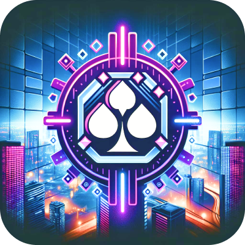

<h1>LUCKY CARD</h1>
<!-- LUCKY CARD -->

## Danh mục

 [I. Mở đầu](#Modau)

 [II. Mô tả](#Mota)

> [1. Ý tưởng](#Ytuong)
>
> [2. Công nghệ](#Congnghe)
>
> [3. Đối tượng sử dụng](#Doituongsudung)
>
> [4. Mục tiêu](#Muctieu)
>
> [5. Tính năng](#Tinhnang)

[III. Cài đặt](#CaiDat)

[IV. Tác giả](#Tacgia)

[V. Người hướng dẫn](#Nguoihuongdan)

[VI. Tổng kết](#Tongket)

<!-- MỞ ĐẦU -->

## I. Mở đầu
Trong bối cảnh công nghệ phát triển mạnh mẽ và xu hướng giải trí kỹ thuật số ngày càng phổ biến, các ứng dụng trò chơi di động đã trở thành một phần không thể thiếu trong đời sống hàng ngày của nhiều người. Trong số đó, Blackjack - một trò chơi bài cổ điển và nổi tiếng trên toàn thế giới, đã thu hút được sự quan tâm lớn từ cộng đồng.

Mục tiêu của đề tài là phát triển một ứng dụng trò chơi Blackjack nhiều người chơi trên thiết bị di động, giúp người dùng có thể trải nghiệm cảm giác hồi hộp và thú vị của trò chơi này mọi lúc, mọi nơi. Ứng dụng sẽ không chỉ tập trung vào việc tái hiện chính xác luật chơi và các chiến lược của trò chơi Blackjack cổ điển mà còn chú trọng đến trải nghiệm người dùng thông qua giao diện thân thiện, tính năng tương tác cao và khả năng kết nối với người chơi khác trên toàn cầu.

Với đối tượng được hướng đến là người dùng di động ở mọi lứa tuổi có nhu cầu giải trí, đầu tiên, ứng dụng cần có lối chơi bám sát với trò chơi Blackjack truyền thống, bao gồm các luật chơi cũng như điều kiện thắng. 

Để tăng tính cạnh tranh và khuyến khích người chơi tiếp tục sử dụng ứng dụng, ứng dụng cần tích hợp hệ thống tiền tệ để trao đổi giữa các người chơi khi thắng hoặc thua, hệ thống kinh nghiệm để xếp hạng người chơi theo cấp độ và lượng tiền.

Để giúp người dùng có lượng tiền để bắt đầu chơi và tiếp tục chơi, ứng dụng cung cấp chức năng điểm danh và chức năng xem quảng cáo để có thể tăng lượng tiền cho người chơi.
Ngoài ra, ứng dụng cần cung cấp một số tiện ích hỗ trợ người dùng như quản lý tài khoản (bao gồm đăng ký, đăng nhập, cập nhật tài khoản), góp ý về ứng dụng và trang hướng dẫn luật chơi.

<!-- MÔ TẢ -->

## II. Mô tả

<!-- Ý TƯỞNG -->

### 1. Ý tưởng

* Giao diện ứng dụng thân thiện, dễ sử dụng đối với người dùng.

* Đáp ứng các tính năng của một trò chơi trực tuyến nhiều người chơi.

* Có thể mở rộng thêm các chức năng, đặc trưng mới trong tương lai.

### 2. Công nghệ
<ul>
    <li>Công cụ : Flutter</li>
    <li>IDE: Visual Studio Code</li>
    <li>Cơ sở dữ liệu: Firebase</li>
    <li>Các công cụ quản lý: Git, GitHub</li>
</ul>

### 3. Đối tượng sử dụng
Đối tượng sử dụng của ứng dụng bao gồm:
* Người dùng có nhu cầu giải trí ở mọi lứa tuổi

### 4. Mục tiêu

 * <strong>Ứng dụng thực tế</strong>
 
    *	Tạo ra một ứng dụng giải trí cho người dùng trên điện thoại di dộng.
   
    *	Hỗ trợ nhiều người chơi trực tuyến cùng lúc.
    	
    *	Tăng sự gắn kết, thư giãn cho mọi người.

 * <strong>Yêu cầu ứng dụng</strong>
 
    * Đáp ứng các tính năng cơ bản cần có của một ứng dụng trò chơi.
    
    * Nâng cao trải nghiệm của người sử dụng.
    
    * Dễ dàng tra cứu các thông tin cần thiết.
    
    * Giao diện thân thiện, dễ sử dụng, bố cục hợp lý, hài hoà về màu sắc và mang tính đồng bộ cao, phân quyền cho người dùng thông qua tài khoản.
    
    * Ứng dụng phải tương thích với đa số các thiết bị sử dụng hệ điều hành Android.

    * Có thể mở rộng thêm các chức năng, đặc trưng mới trong tương lai.

### 5. Tính năng

 * <strong>Danh sách tính năng</strong>

    * Đăng nhập, đăng ký, đăng xuất, quên mật khẩu, cập nhật thông tin cá nhân.
    
    * Điểm danh hằng ngày.
    
    * Bảng xếp hạng.
    
    * Xem quảng cáo để kiếm thêm xu.
    
    * Hướng dẫn.

    * Tạo phòng chơi mới.

    * Vào phòng chơi đã có bằng cách nhập mã phòng.

    * Xem danh sách các phòng đang có.

## III. Hướng dẫn cài đặt
### Yêu cầu

* Flutter SDK
* Dart SDK
* A code editor (e.g. Visual Studio Code, IntelliJ IDEA)

### Cài Đặt

1. Tải Flutter SDK từ [the Flutter website](https://flutter.dev/sdk/).
2. Cài đặt Dart SDK từ [the Dart website](https://dart.dev/get-dart).
3. Tải Lucky Card Source : [Lucky Card Game App](https://github.com/leehungw/Blackjack)
4. Trong dự án, chạy các lệnh sau để khởi chạy những thư viện cần thiết:
   
+ flutter pub get
5. Chạy ứng dụng bằng cách nháy chọn nút "Run" trên IDE của bạn.
  
  Ứng dụng sẽ được chạy trên thiết bị (thật hoặc ảo) của bạn.

## IV. Tác giả

* [Phạm Thanh Tường](https://github.com/TuongPhamCT)

* [Lê Ngọc Hưng](https://github.com/leehungw)

* [Huỳnh Đăng Quang](https://github.com/hdquang437)

<!-- NGƯỜI HƯỚNG DẪN -->

## V. Người hướng dẫn
* Giảng viên: Huỳnh Tuấn Anh

<!-- TỔNG KẾT -->

## VI. Tổng kết
Sản phẩm là kết quả sau quá trình cùng nhau thực hiện đồ án của những thành viên trong nhóm. Thông qua quá trình này, các thành viên đã có cho mình những lượng kiến thức và kỹ năng chuyên môn nhất định về quy trình lập trình thực tế, hiểu hơn về lập trình và có riêng cho mình những bài học quý giá làm hành trang cho công việc sau này.

Ngoài ra, nhóm cũng muốn gửi lời cảm ơn chân thành và sự tri ân sâu sắc đến giảng viên giảng dạy, thầy Huỳnh Tuấn Anh đã cùng đồng hành với nhóm trong suốt quá trình thực hiện đồ án để có được thành quả như hôm nay.

Sản phẩm của nhóm có thể còn nhiều thiếu sót trong quá trình xây dựng và phát triển. Vì vậy, đừng ngần ngại gửi những đóng góp hoặc ý kiến của bạn đến với chúng tôi. Mỗi đóng góp của các bạn đều sẽ được ghi nhận và sẽ là động lực để nhóm có thể hoàn thiện sản phẩm hơn nữa.

Cảm ơn bạn đã quan tâm!

---

<a href="#Top">Quay lại đầu trang</a>

